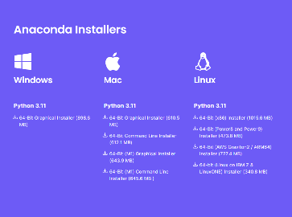
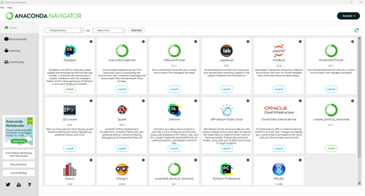
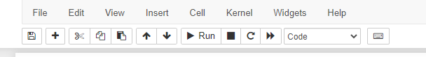

# Intro to Jupyter
## Installation
Installation of Anaconda is relatively straightforward, just go to this [link](http://anaconda.com/), and click the download icon

which should automatically detect your operating system. Else, you could look for the _Anaconda installers_ box at the bottom of the web page. At the time of this writing, the latest version is Anaconda 23.7.4 or 2023.07.2 using Python 3.11.

There will be a few installation steps to click through - you can generally use the defaults. For detailed instructions, here are the particular OS installation guides:

- [Windows computers](https://docs.anaconda.com/free/anaconda/install/windows/)
- [MacOS](https://docs.anaconda.com/free/anaconda/install/mac-os/)
- [Linux](https://docs.anaconda.com/free/anaconda/install/linux/)

## Opening the Anaconda Navigator

Following a successful installation, you should be able to open the Anaconda navigator.

### Windows computers

Click on the Windows Icon and search through the applications installed on your computer and open via the Anaconda Icon, which should look like this icon. Alternatively, you can type *anaconda-navigator* in the search tool located in the task bar (notice that, by default, searching in Windows is not case sensitive).

### MacOS

Open your Finder and go to the *Applications* Folder, look for *Anaconda-Navigator*, with the same icon you see above.

### Linux

Open a terminal window and type *anaconda-navigator*.
Upon successfully opening the navigator you should see something resembling the following window. Be patient, it sometimes takes a while to load.

The navigator can be used to start many applications. Those of interest to us are mainly the Jupyter Notebook reader and a terminal shell. The advantage of starting a command shell from the navigator is that all the environment variables are already pre-configured for Python. On Windows, we recommend using the PowerShell Prompt over CMD, as the former provides command line editing and history and is therefore more user friendly.

## Opening a Jupyter notebook

Start the anaconda navigator and launch the Jupyter Notebook interpreter by clicking on the Launch button of the icon shown here.

The Jupyter Notebook interpreter will start a virtual web server on your computer (localhost) that will be visualized through your default web browser. One can also choose JupyterLab which has a few more features. Either one will work fine.

The opening page will show the files on your computer. By clicking on the directories, navigate to where you saved the notebooks. As before, '..' stands for returning to the parent directory. Note that unlike other navigators (e.g., Explorer) a single click is necessary to open a directory.

Jupyter notebooks end with the *.ipynb* file extension. Clicking on the desired file will open the Jupyter Notebook interpreter of that file in a different tab of your browser. These notebooks contain intructions as well as code that can be edited and run. Boxes starting with the *In [  ]* keyword are called *code cells*; they are a block of Python code input waiting to be run. Other boxes, called *markdown cells*, are meant to give instructions. The number between brackets keeps track of the instruction numbers, showing the sequence of the instructions that were run, possibly out of order. A cell generating output will have an *Out[  ]* with an associated sequence number in the brackets. An entire notebook can be reset by restarting the kernel and clearing all output and the state of all variables. This is done through selecting *Restart and Clear Output* under the *Kernel* tab.

## Running a Jupyter notebook

To run a block of code, click on the box and the surrounding perimeter of that box will turn green, indicating that it is ready to run with hitting *Crtl-Enter*. Alternatively, *Shift-Enter* will achieve the same result, except that the mouse focus will jump to the next cell. Double-clicking on a markdown cell will switch the cell to the editing mode and show the raw (markdown) code for the text. Running the cell (*Ctrl-Enter*) will (re-)generate the nice text. Code cells, on the other end, can be edited directly once the mouse focus is on that cell (i.e., there is no need to double-click to edit those cells).

The menu at the top of the page contains the main commands and will indicate the type of cell where the mouse is focusing. Clicking on run is another way to run the current cell, equivalent to *Shift-Enter*. It is also possible to run all the cells in the notebook by selecting *Run All* under the *Cell* (Jupyter) or *Run* (Jupyter Lab) headings. Notice all the shortcuts indicated in these menus, providing a keyboard alternative. Moreover, the *Help* tab contains a *User Interface Tour*, as well as reference to the Python langage and its most popular packages such as pandas and NumPy, for example. Use these references if needed. You should minimally read the *User Interface Tour* if you are new to Jupyter Notebook.

If you want to run the all the commands in a notebook, just look under the *Run* menu and select *Run All*. For a fresh run, one can also select *Restart Kernel and Run All*.

Copyright Martin-D. Lacasse (2023)
