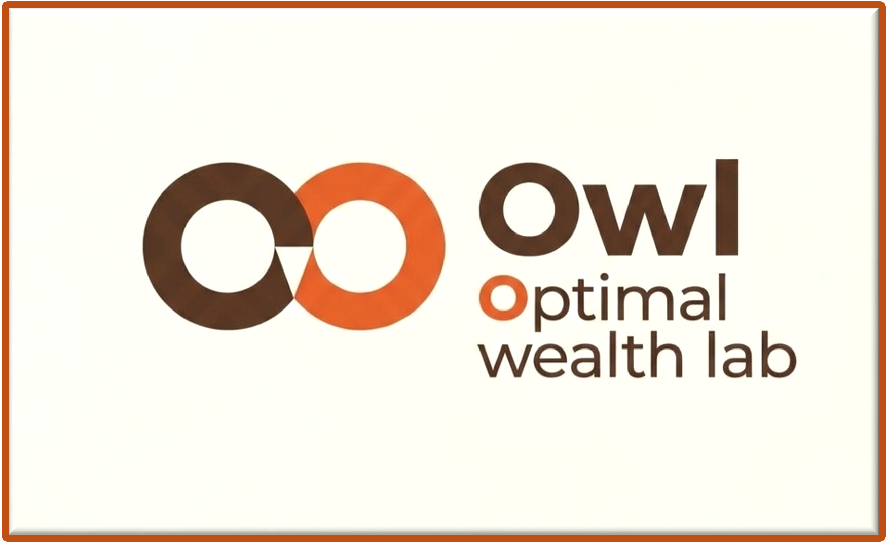

# Owl - Optimal Wealth Lab

## A retirement exploration tool based on linear programming

-------------------------------------------------------------------------------------

### TL;DR
Owl is a retirement financial planning tool that uses a
mixed-integer linear programming optimization algorithm to provide
guidance on retirement decisions
such as contributions, withdrawals, Roth conversions, and more.
Users can select varying return rates to perform historical back testing,
stochastic rates for performing Monte Carlo analyses,
or fixed rates either derived from historical averages, or set by the user.

Owl is designed for US retirees as it considers US federal tax laws,
ACA marketplace premiums (pre-65), Medicare premiums, rules for 401k including
required minimum distributions, maturation rules for Roth accounts and conversions,
social security rules, etc.

There are three ways to run Owl (from easiest to more complex):

1) **Streamlit Hub:** Run Owl remotely as hosted on the Streamlit Community Cloud at
[owlplanner.streamlit.app](https://owlplanner.streamlit.app).

1) **Docker Container:** Run Owl locally on your computer using a Docker image.
Follow these [instructions](docker/README.md) for using this option.

1) **Self-hosting:** Run Owl locally on your computer using Python code and libraries.
Follow these [instructions](INSTALL.md) to install from the source code and self-host on your own computer.

---------------------------------------------------------------
## Documentation

| Document | Description |
|---------|-------------|
| [INSTALL.md](INSTALL.md) | Installation guide, Python environment setup, and developer build steps |
| [USER_GUIDE.md](USER_GUIDE.md) | Python API usage with examples for Jupyter notebooks and scripts |
| [PARAMETERS.md](PARAMETERS.md) | Complete reference for TOML case file parameters |
| [RATE_MODELS.md](RATE_MODELS.md) | Available rate models (historical, stochastic, bootstrap, etc.) |
| [docs/modeling-capabilities.md](docs/modeling-capabilities.md) | Summary of modeled components, assumptions, and limitations |
| [papers/owl.tex](papers/) | Mathematical foundations (PDF build via LaTeX) |

Documentation for the app user interface is also available from the [Streamlit UI](https://owlplanner.streamlit.app/Documentation).

---------------------------------------------------------------------

## Credits and Acknowledgements
See [CREDITS.md](CREDITS.md).

## Bugs and Feature Requests
Please submit bugs and feature requests through
[GitHub](https://github.com/mdlacasse/owl/issues) if you have a GitHub account
or directly by [email](mailto:martin.d.lacasse@gmail.com).
Or just drop me a line to report your experience with the tool.

## Privacy
This app does not store or forward any information. All data entered is lost
after a session is closed. However, you can choose to download selected parts of your
own data to your computer before closing the session. These data will be stored strictly on
your computer and can be used to reproduce a case at a later time.

---------------------------------------------------------------------

Copyright &copy; 2024-2026 - Martin-D. Lacasse

Disclaimers: This code is for educational purposes only and does not constitute financial advice.

Code output has been verified with analytical solutions when applicable, and comparative approaches otherwise.
Nevertheless, accuracy of results is not guaranteed.

--------------------------------------------------------

